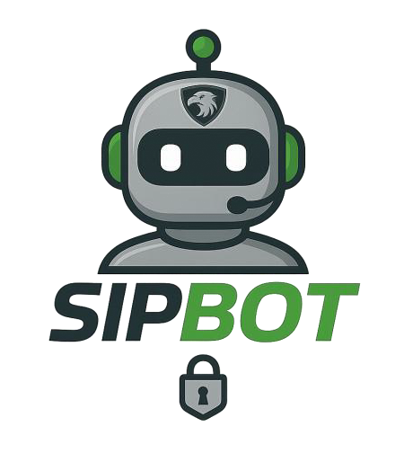

  

  <i>"Conectando la ingeniería con la inteligencia artificial para construir el futuro, hoy."</i>

---

## 👋 Sobre mí

Soy un **Ingeniero de Telecomunicaciones** apasionado por la tecnología, con más de 5 años explorando el universo de la Inteligencia Artificial. Mi camino profesional ha estado marcado por la curiosidad, la experimentación y el deseo de construir soluciones que transformen realidades.

---

## 🚀 Misión

Mi enfoque profesional se construye sobre tres pilares:

- **🧠 Exploración de IA:** Dominio de los principales LLMs (Gemini, GPT, Claude, etc.), profundizando en sus arquitecturas, fortalezas y aplicaciones reales.
- **🤖 Automatización Inteligente:** Desarrollo de flujos autónomos con Python, N8N y Make, integrando IA para decisiones y ejecución de tareas.
- **💡 Innovación Práctica:** Convertir la teoría en productos útiles, escalables y que demuestren el valor de la IA en la vida real.

---

## 🛠️ Tech Stack

Trabajo diariamente con estas tecnologías:

  <a href="https://skillicons.dev">
    
     
    
  </a>

---

---

## 📊 Estadísticas en GitHub

  
  

---

## 🌟 Proyectos Destacados

### SIPBOT

  

**SIPBOT** Asistente Virtual de **SIPGRUP** RAG
Especializado en Seguridad Privada, Alarmas, Acuda y Atención Comercial
**Función principal:**
SIPBOT es un asistente virtual diseñado para asistir al personal de la Central Receptora de Alarmas, vigilantes, operadores de Acuda, personal administrativo y también a clientes interesados en los servicios de la empresa SIPGRUP. Sus respuestas son basadas **únicamente** en la información recuperada desde la **base de conocimientos vectorial** de la empresa.

- 💡 Inteligencia Artificial para gestión de llamadas.
- 🔒 Seguridad en la transmisión de datos.
- 🤖 Integración sencilla con plataformas existentes.

---

## 📫 ¡Conectemos!

Estoy abierto a colaboraciones y conversaciones sobre IA, automatización y tecnología. ¡No dudes en contactarme!

  
  &nbsp;
  

---

  
Más sobre mí

  <ul>
    <li>🌍 Ubicación: <b>Empuriabrava, España</b></li>
    <li>👨‍💻 Actualmente trabajando en: <b>SIPGRUP/Departamento I+D</b></li>
    <li>🎓 Formación: <b>Universidad Experimental de la Fuerza Armada Venezuela, Especialista de Telecomunicaciones</b></li>
    <li>🗣️ Idiomas: Español, Inglés</li>
  </ul>

